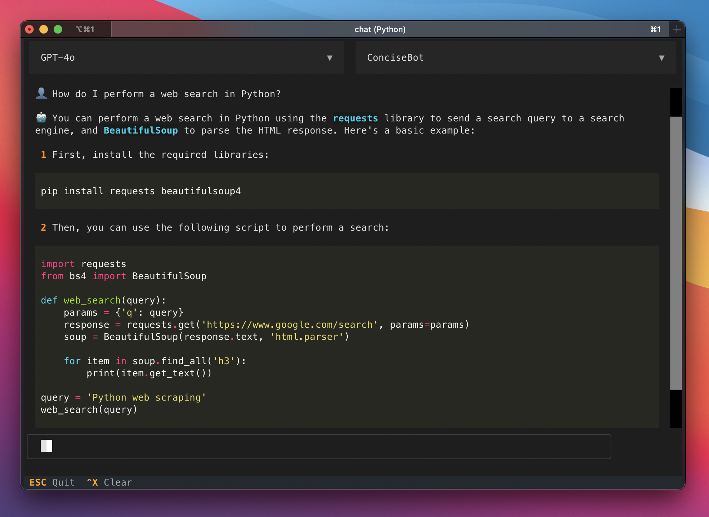

# About chat
Chat with ChatGPT in your terminal!

This is a Command Line Interface (CLI) that allows you to chat with ChatGPT in your terminal. It is built using the [textual](https://textual.textualize.io/) library for Python and provides a simple and interactive way to access models like gpt-3.5, gpt-4 and gpt-4o.

Author: Isak Barbopoulos (isak@xaros.org)



---

<details>
    <summary>Installation</summary><br>

#### 1. Make sure you have python >=3.9 and an OpenAI API key.

#### 2. Open your terminal of choice and clone this repo

```bash
git clone https://github.com/isak-b/chat.git
```

#### 3. Install the package and its dependencies
```bash
cd chat
pip install .
```

#### 4. Create a file named '.env' in the chat folder and add the following line:
```bash
OPENAI_API_KEY=<your OpenAI API key here>
```
</details>

<details>
    <summary>Start a new chat</summary><br>

Open a terminal in the chat folder and write:

```bash
python src
```

TIP: Bind the command to an alias (like 'chat') and store it in .bashrc or .zshrc for easy access. E.g.,:

```bash
alias chat='python ~/path/to/chat/src'
```

</details>

<details>
    <summary>Create your own assistants</summary><br>

Write instructions in a .txt file and save it in `chat/bots/` and it will become automatically available as a bot.

</details>

<details>
    <summary>Todo</summary><br>

- Make it so users can save chat history again (and let them create, name and select history_ids at will)

- Add support for other LLMs

- Add image generation (not currently supported by textual)

</details>
