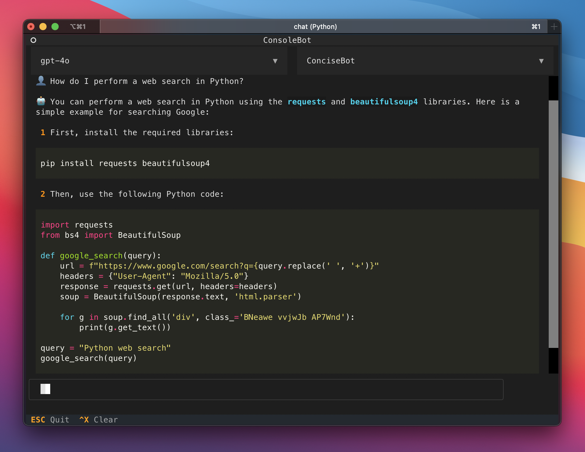
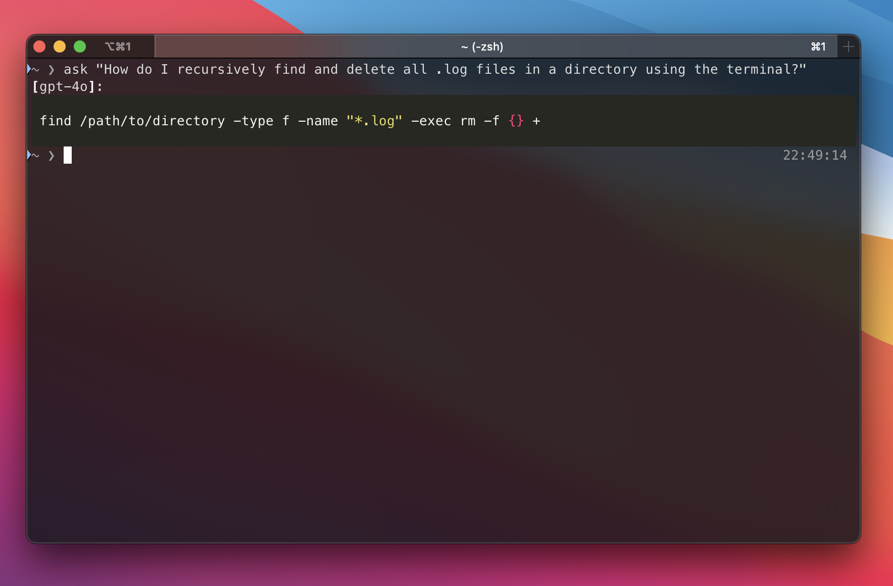

# About ConsoleBot
Chat with ChatGPT in your terminal!

This is a Command Line Interface (CLI) that allows you to chat with ChatGPT in your terminal.

**Author**: Isak Barbopoulos (isak@xaros.org)

### Example usage

You can either open an interactive chat interface that runs in your terminal (built with the [textual](https://textual.textualize.io/) library for Python):



Or get an answer to a single question directly in the terminal:



See more details on how to install and use the bot below.

---

<details>
    <summary>Installation</summary><br>

#### 1. Make sure you have Python >=3.9 and an OpenAI API key.

#### 2. Open your terminal of choice and clone this repo:
```bash
git clone https://github.com/isak-b/console-bot.git
```

#### 3. Install the package and its dependencies:
```bash
cd console-bot
pip install .
```

#### 4. Create a file named '.env' in the console-bot folder and add the following line:
```bash
OPENAI_API_KEY=<your OpenAI API key here>
```
</details>

</details>

<details>
    <summary>Chat: Open an interactive chat interface</summary><br>

Open a terminal in the console-bot folder and write:

```bash
python chat
```

TIP: Bind the command to an alias (like 'chat') and store it in .bashrc or .zshrc for easy access. E.g.,:

```bash
alias chat='python ~/path/to/console-bot/chat'
```

</details>

<details>
    <summary>Ask: Get an answer directly in the terminal</summary><br>

Open a terminal in the console-bot folder and write:

```bash
python ask "What is the airspeed velocity of an unladen swallow?"
```

TIP: Bind the command to an alias (like 'ask') and store it in .bashrc or .zshrc for easy access. E.g.,:

```bash
alias ask='python ~/path/to/console-bot/ask'
```

<details>
    <summary>Create new bots</summary><br>

Write your custom instructions in a .txt file and save it in `console-bot/chat/bots/`, and it will become automatically available in the app. 

Note that the "ask" version of ConsoleBot has its own bots directory (`console-bot/ask/bots`), so if you wish to add/modify its instructions you'd have to add the instructions to that folder and then enter the name of the bot (i.e., the filename minus the file extension, so e.g., "AskBot" for "AskBot.txt") at the "bot" key in `console-bot/ask/config-yaml`.

</details>

<details>
    <summary>Todo</summary><br>

- Make it so users can save and manage chat history (create, name and select history_ids at will)

- Add support for other LLMs

- Add image generation (not currently supported by textual)

</details>
